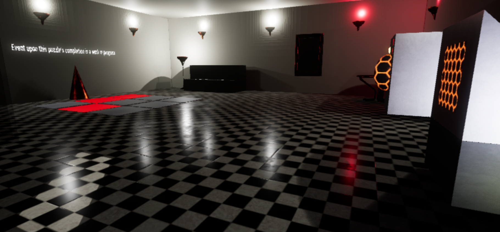
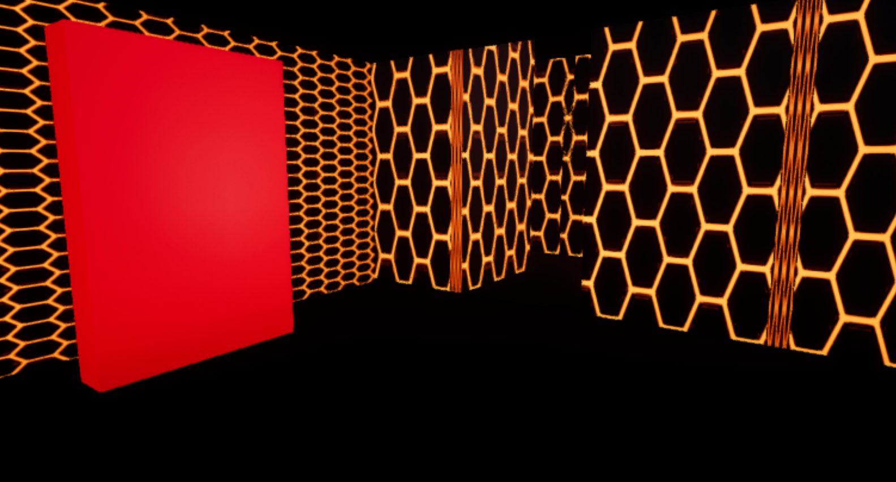
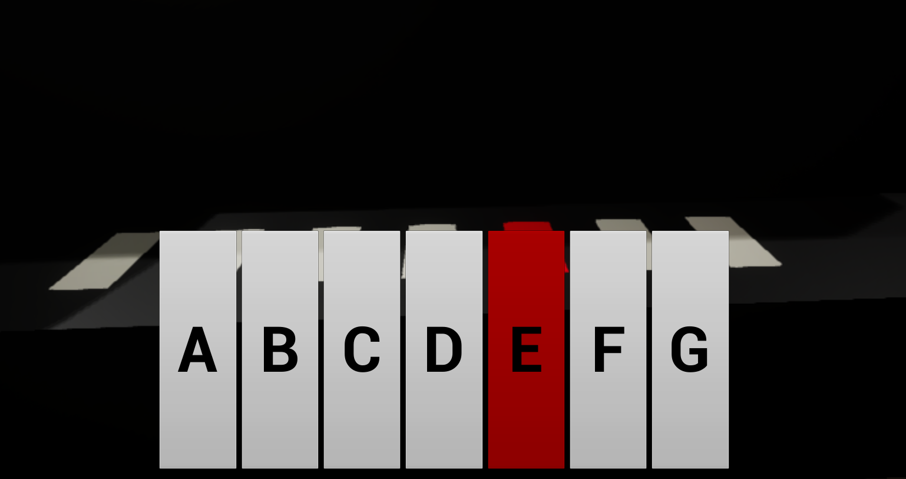
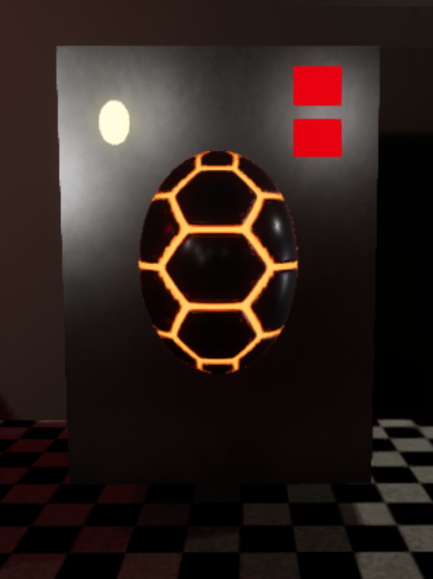
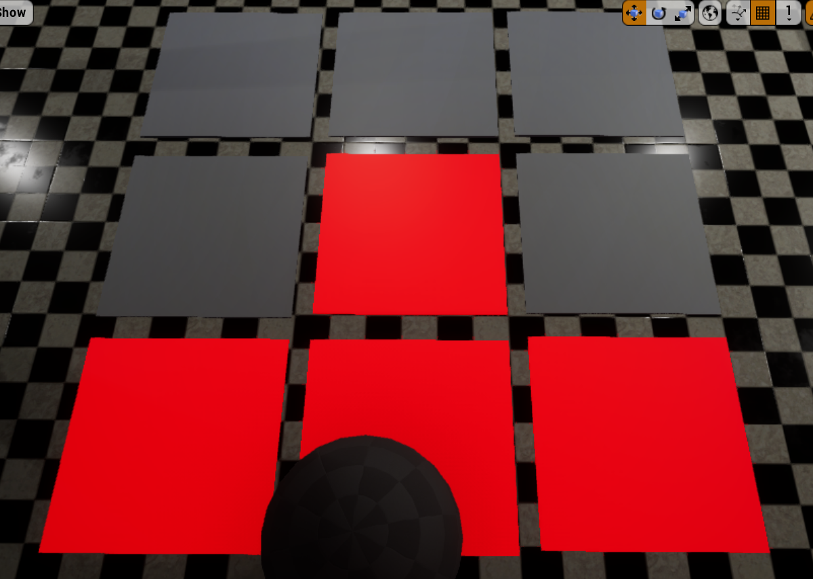
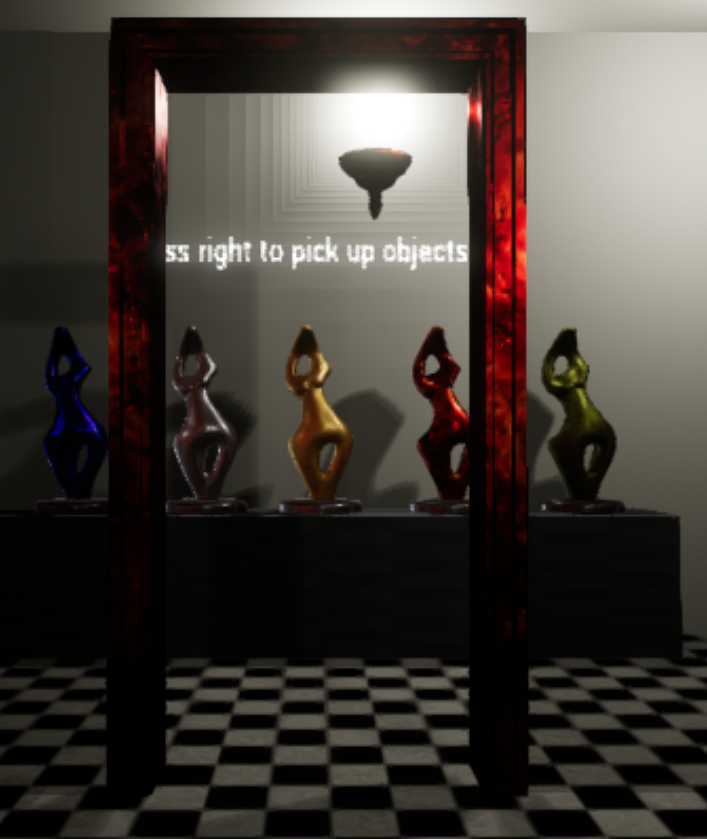

# Escape Game Overview

An escape room using Unreal Engine 4

Concept  
•	Core concept: Escape the room  
•	You awaken in a locked room, unable to escape  
•	Use environmental clues such as light and sound to determine what to do next  
  
Rules  
•	No lose condition, apart from the feeling you’re going to die in this room if you don’t get out  
•	Anything that you can do, you are allowed to do  
  
Requirements  
•	Unreal’s provided Starter Content pack  
•	C++ code and Blureprint to encode behavior  
•	Various sound effects to enhance atmosphere  
•	Sketches for layout of room(s)  
•	Sketches for how puzzles work  

# Escape room

# Maze
Escape for a clue

# Piano puzzle
Play the right song

# Stereo
Click the right channel to play a hidden song

# Tile puzzle
Light up all the tiles

# Color puzzle
Pick up the correct trophies to unlock the door

